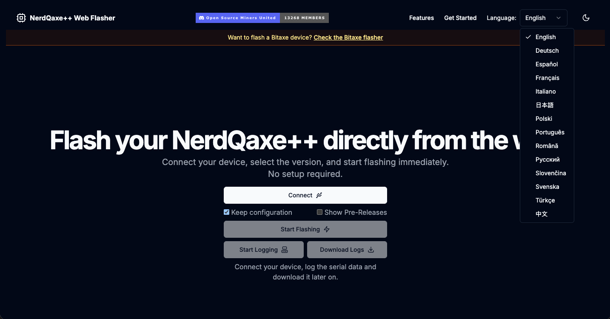

## NerdQaxe++ Web Flasher

[](https://C4Wiz.github.io/nerdqaxe-web-flasher/)

The NerdQaxe++ Web Flasher is the open source tool that provides you an easy solution to flash a factory file to you NerdQaxe++.

## Flashing process

Simply connect your device, select the firmware version and click on flash.

## Development / Run locally

You can use Docker for compiling the application and to run it locally by

```bash
# build the image
docker build . -f Dockerfile -t nerdqaxe-web-flasher

# run the container in background without hot reload
docker run --rm -d -p 3000:3000 nerdqaxe-web-flasher

# run the container in foregroud with hot reload on file changes
docker run --rm -it -p 3000:3000 -v $(pwd):/app nerdqaxe-web-flasher
```

and access it by `http://localhost:3000`
